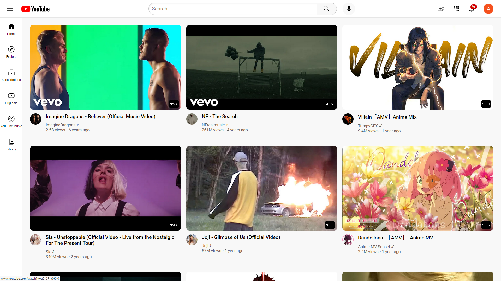

# YouTube Clone - MySongs 🎵

[Live Demo](https://dcosta-arvin-arun.github.io/YouTube_Clone_mySongs)


---

## Description

A responsive YouTube-inspired music video gallery built with **HTML and CSS**. Browse popular music videos, explore categories, and enjoy a clean, modern UI.  

This project demonstrates **responsive layout design, semantic HTML structuring, and CSS styling techniques**, providing a foundation for frontend web development.

---

## Features

- Responsive layout for desktop and mobile  
- Sidebar navigation (Home, Explore, Subscriptions, Originals, YouTube Music, Library)  
- Search bar and voice search icon (UI only)  
- Video thumbnails with duration overlays  
- Profile images and video info  
- SVG icons for navigation and actions  

---

## Screenshots

### Home Page


---

## Folder Structure

- `index.html` — Main application page  
- `YouTubeClone.css` — Stylesheet  
- `buttons/` — UI icons (SVG, JPG)  
- `Sidebar-icons/` — Sidebar navigation icons  
- `thumbnails/` — Video thumbnail images  
- `profiles/` — Profile images for video authors  

---

## Getting Started

To run locally:

1. Clone the repository:
   ```bash
   git clone https://github.com/Dcosta-Arvin-Arun/YouTube_Clone_mySongs.git